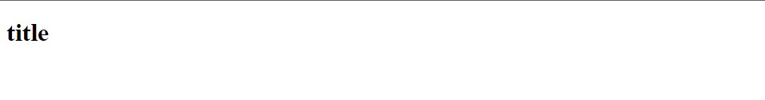
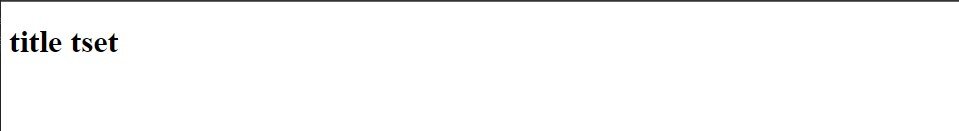

# JavaScript 筆記

<!-- 回頂部 -->
[<div style="position: fixed; bottom: 0px; right: 0px;">頂部</div>](#javascript-筆記)


## 目錄
- [JavaScript 筆記](#javascript-筆記)
  - [目錄](#目錄)
  - [撰寫 JavaScript](#撰寫-javascript)
  - [基本資料型態 & 變數](#基本資料型態--變數)
    - [資料型態](#資料型態)
    - [變數 Variable](#變數-variable)
  - [字串 String](#字串-string)
  - [數字 Number](#數字-number)
  - [基本輸出入 IO](#基本輸出入-io)
  - [陣列 array](#陣列-array)
  - [函式 function](#函式-function)

---
## 撰寫 JavaScript

1.在 `html` 檔案內加入 `<script>` 標籤撰寫 `JavaScript` 程式。

```html
<script>
    document.write("<h1>title<h1>");
</script>
```



2.在`<script>` 標籤加入 `src` 屬性來引入 `JavaScript` 檔案， `"../js/script.js"` 為 `JavaScript` 檔案路徑。

```html
<!-- html -->
<script src="../js/script.js">

</script>
```

```js
// JavaScript
document.write("<h1>title tset<h1>");
```



---
## 基本資料型態 & 變數
### 資料型態

字串

```js
"string"
```

數字、浮點數

```js
456
-35
123.555
```

布林值

```js
true
false
```

### 變數 Variable

使用容器儲存資料。
命名規則 : 開頭不能是數字，只能是英文大小寫或是數字或是$或是_的組合。

```js
var my_name = "Joe";    
var my_age = 20;
var is_male = true;
```

---

## 字串 String

`\"` 來在字串內表示 `"` 符號

```js
var string = "\"";
```

將字串英文字母轉換成大小寫

```js
string.toUpperCase();   //  轉成大寫
string.toLowerCase();   //  轉成小寫
```

拿取字串第 n 個字元 ( 從 0 開始 )。

```js
var n = 0;
string.charAt(n);
```

在字串內尋找內容回傳開頭 index 沒找到則回傳 -1 。

```js
string.indexOf("string");
```

取得子字串。

```js
string.substring(2, 10);
```

---

## 數字 Number

基本運算同 `c++` 等語言。<br>

絕對值、最大值、最小值、四捨五入、隨機值，
```js
Math.abs();
Math.max();
Math.min();
Math.round();
Math.random();
```

---

## 基本輸出入 IO

輸入 (預設接受為字串)

```js
prompt("input");
```

輸出

```js
document.write("output");
```

---

## 陣列 array

與 `python` 的 `list` 有點像可加入不同型態資料。

```js
var scores = [20, 50, 60, 440, 90];
var names = ["John", "Joe", "Max"];
var diff = [20, "Joe", true];
```

---

## 函式 function

函式建立、呼叫。

```js
function hello() {
    document.write("hello world");
}

hello();
```

加入參數。

```js
function hello(name) {
    document.write("hello " + name);
}

hello("Joe");
```

回傳值。
```js
function add(num1, num2) {
    return num1 + num2;
}

var sum = add(3, 7);
```

---